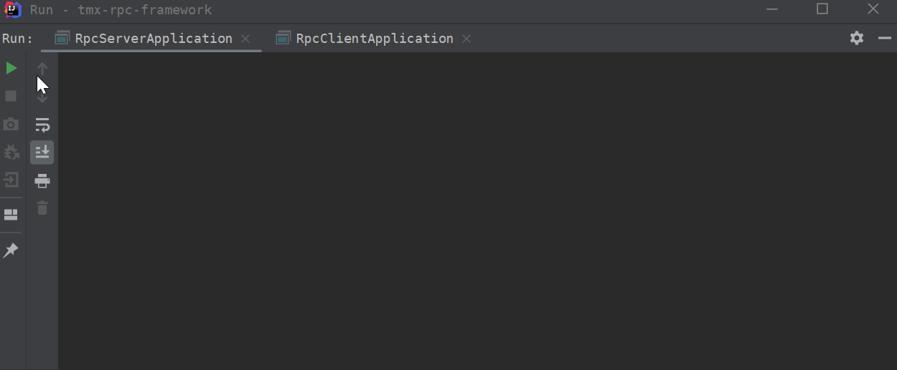
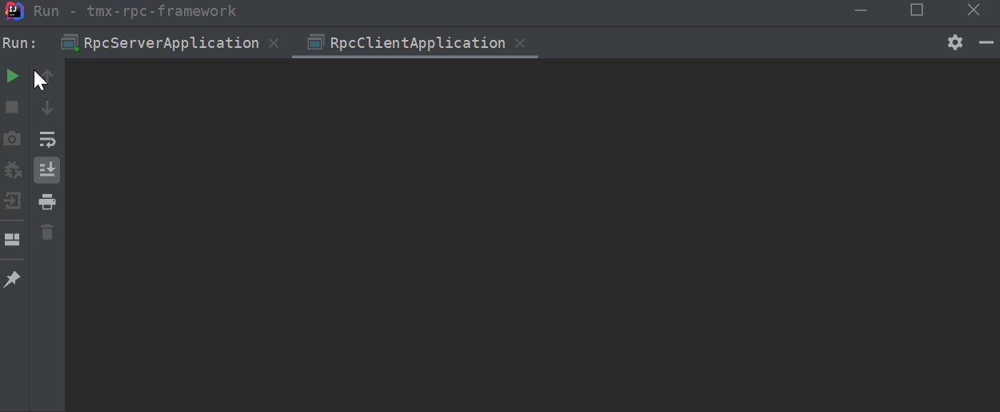
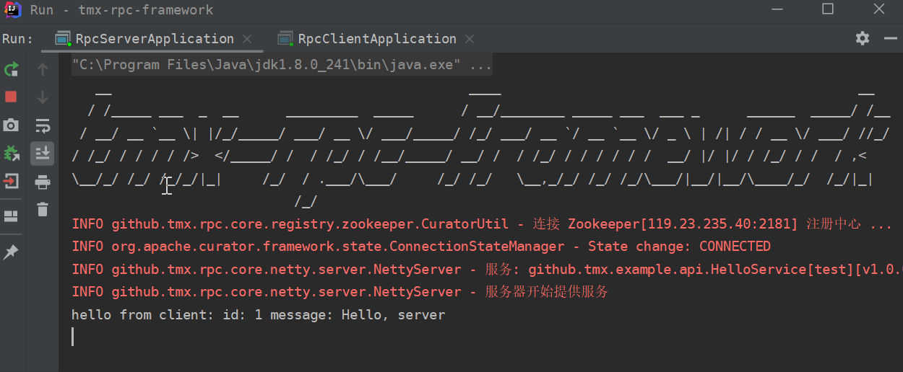
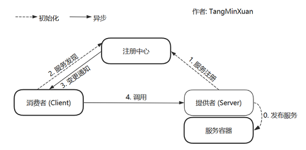

# tmx-rpc-framework

### 简单演示
- **启动服务端**

显示 "服务器开始提供服务" 则表示启动成功

- **启动客户端**

显示执行结果: "hello from client: id: 2 message: Hello, client"

- **优雅停机**
  
以上演示基于源码中的 `example-server` 模块和 `example-client` 模块, 您也可自行运行观看效果

### 框架架构
  
服务提供者向服务容器发布服务, 并向注册中心注册服务, 接着服务消费者向注册中心发现自己需要的服务, 最后通过网络请求完成调用. 
与强大的 Dubbo 的架构非常相似  

### 自我介绍
[tmx-rpc-framework](https://github.com/TangMinXuan/tmx-rpc-framework) 是一款基于 Netty 实现的简易 RPC 框架, 
致力于让调用远程方法如同调用本地方法一样自然, 优雅. 为了更好地屏蔽底层逻辑, 他支持使用注解的方式进行服务的发现与注册. 此外, 一些重要的组件, 
例如说: 注册中心, 序列化框架, 服务容器等, 写成了扩展点(SPI), 这样以后更换起这些组件就更加方便了  


### 编写动机
虽然业界已经有非常多优秀的开源 RPC 框架了, 例如: 阿里巴巴的 Dubbo, Google 的 gRPC ... 
但是本着提升自己, 学习造轮子, 努力成为一名开源人的目的, 我在实习结束后
便萌生了自己写一个简易能跑的 RPC 框架的想法. 虽说 RPC 的理论知识不难, 但在实现的过程中, 我也遇到了许多的问题. 
通过不断的尝试去解决这些问题, 我了解到了不少 RPC 框架底层原理以及各种 Java 编码技巧.  
> 本示例中的 119.23.235.40 这个地址是我的阿里云地址, 因为费用问题, 暂时不能用了, 您可以搭建本地的注册中心完成启动

### 如何使用
[tmx-rpc-framework](https://github.com/TangMinXuan/tmx-rpc-framework) 使用起来非常简单, 实际上, 您只需要使用简单的几个注解, 就能使用 RPC 服务  
步骤1.   
从 GitHub 克隆项目, 再安装到本地 maven 仓库, 最后引入 jar 包
   ```
   git clone https://github.com/TangMinXuan/tmx-rpc-framework.git
   ```
使用 `cd` 命令进入 clone 到的本地位置, 执行 `mvn install` 命令, 我在这里将项目克隆到了桌面的 temp 文件夹
   ```
   cd C:\Users\Administrator\Desktop\temp\tmx-rpc-framework

   mvn install
   ```  
最后新建一个空的 maven 项目, 在 `pom.xml` 中引入上一步 install 到本地仓库的 jar 包
   ```xml
   <dependency>
        <groupId>github.TangMinXuan</groupId>
        <artifactId>rpc-framework-core</artifactId>
        <version>1.0-RELEASE</version>
   </dependency>
   ```
到这为止框架就配置好了, 下面使用他做一个简单的远程调用  

步骤2. 使用 `@EnableRPC` 注解标记服务提供者 (provider) 和服务消费者 (consumer) 的启动类
   ```java
   @EnableRPC
   public class RpcServerApplication {
       public static void main(String[] args) throws IOException {
           ApplicationContext ctx = new AnnotationConfigApplicationContext(RpcServerApplication.class);
           System.in.read();
       }
   }
   ```
步骤3. 在 resources 文件夹中新建一个 rpc.properties, 在这里为了方便只配置了 Zookeeper 的地址, 
更多的配置项见下面的 **可配置项**
   ```
   # 配置 Zookeeper 地址, 默认使用本地的地址, 如果没有的朋友也可以直接用下面我的阿里云这个
   rpc.zookeeper.address = 119.23.235.40:2181
   ```

步骤4. 使用 `@RpcService` 标记实现了接口的服务提供类, 在这里 `HelloService` 是暴露的接口
   ```java
   @RpcService
   public class HelloServiceImpl implements HelloService {
       @Override
       public Hello sayHello(Hello hello){
           // 您的实现
       }
   }
   ```
步骤5. 使用 `@RpcReference` 标记暴露接口的引用
   ```java
    public class HelloController {
        @RpcReference
        HelloService helloService;
        
        // 直接使用 helloService 这个引用来调用需要的方法
    }
   ```


### 重要组件
- **Netty** 是网络通信组件, 为上层提供 NIO 的通信方式, 此外, 双向心跳机制和对通信协议的封装也是基于 Netty 来实现的.

- **Zookeeper** 框架注册中心的一种实现, 得益于 Zookeeper 的 Watcher 设计, 服务提供者(provider)在注册与注销服务时, 
订阅相应接口的服务消费者(consumer)都能得到及时的反馈. 

- **Nacos** 框架的注册中心的一种实现, 相较于Zookeeper实现CAP理论中的CP, Nacos实现的是AP, 更适合服务节点频繁上下线的情况

- **Protostuff** 是默认的序列化组件, Protostuff 是由 Protobuf 改进来的, 选择 Protostuff 的一个很重要原因是如果不考虑跨语言, 
Protostuff 的序列化/反序列化速度在一众序列化组件中名列前茅, 我还适配了 Kryo , Kryo 的特点是序列化后的包体积比较小. 能减少网络开销. 

- **Spring** 是作为默认的服务容器来使用, 当然, "扫描注解" 这个功能也交给了擅长扫描 Bean 的 Spring 来实现

### 文件结构
```
tmx-rpc-framework
  ├─example-...     - 一些 demo , 方便用户快速了解如何使用这个框架
  └─rpc-framework-core
      ├─common      - 公共部分, 包括一些异常的定义, 一些枚举信息, 工具类等
      ├─config      - 框架配置, 在这里实现读取用户的配置信息(rpc.properties)
      ├─container   - 服务容器, 存储 provider 发布的服务实现类
      ├─extension   - 扩展点(SPI), 决定一些重要组件的实现类
      ├─loadbalance - 负载均衡, 包括负载均衡接口和内置策略
      ├─netty       - 通信组件, 包括心跳机制, 反射调用等都是在这实现
      │  ├─client   - 客户端
      │  ├─codec    - 编解码器
      │  └─server   - 服务端
      ├─registry    - 注册中心, 使用 Zookeeper or Nacos 实现了服务注册与发现
      ├─serialize   - 序列化组件, 为编解码器提供序列化/反序列化服务
      └─spring      - Spring 相关组件, 主要包括注解扫描, Bean 的扫描与注册等
```

### 可配置项
一个优秀的框架应该是灵活可配置的, 下面例举了一部分重要的配置项, 更多配置项可去 `config/ConfigurationEnum.java` 中查看  
```
# 注册中心地址
# rpc.zookeeper.address = 127.0.0.1:2181
rpc.nacos.address = 127.0.0.1:8848

# Zookeeper 根目录
rpc.zookeeper.rootPath = /tmx-rpc

# 连接 Zookeeper 失败时的重试次数
rpc.zookeeper.retryCount = 3

# 服务器监听端口
rpc.server.port = 9999
# 服务器最大容忍客户端停顿时间, 若超过这个时间未收到客户端消息, 主动关闭连接 (单位: 秒)
rpc.server.maxPauseTime = 30

# 客户端 PING 的数量达到这个值时主动关闭连接
rpc.netty.heartbeatThreshold = 3

# 客户端最大容忍服务器响应时间, 若超过这个时间未得到服务器响应则认为服务器宕机, 主动关闭连接 (单位: 秒)
rpc.client.maxPauseTime = 10

# 客户端连接服务端失败时的重试次数
rpc.client.retryCount = 3

# 客户端负载均衡策略
rpc.client.loadBalance = Random

# 序列化组件
rpc.serializer = Protostuff
```


### 未来演变
- [x] 使用 Netty（基于 NIO）作为底层网络通信
- [x] 使用 Kryo 作为序列化框架
- [x] 使用 Zookeeper 作为注册中心, 管理服务提供者的地址信息
- [x] 使用 Map 缓存已经建立的 Channel 避免重复连接服务端
- [x] 使用 CompletableFuture 异步接收RPC执行结果
- [x] 增加 Netty 双向心跳机制
- [x] 使用注解进行服务注册(提供者)和服务消费(消费者)
- [x] 适配 Spring
- [x] 集成 Spring Boot
- [x] 支持读取配置文件(rpc.properties)配置文件来配置
- [x] 支持简易的 SPI
- [x] 序列化方式可配置
- [x] 客户端选择服务提供者的时候进行负载均衡 (发布服务的时候增加 一个 loadbalance 参数)
- [x] 增加服务分组和版本号 (version, group)
- [x] 自己写一个网络通信协议, 原有的 RpcRequest 和 RpcRequest 对象作为消息体
  - 魔数: 4 个字节, 用来服务端筛选有效报文
  - 序列化框架编号: 与客户端商量好序列化方式
  - 消息体长度
- [x] 适配 Nacos 作为注册中心
- [ ] ......  

